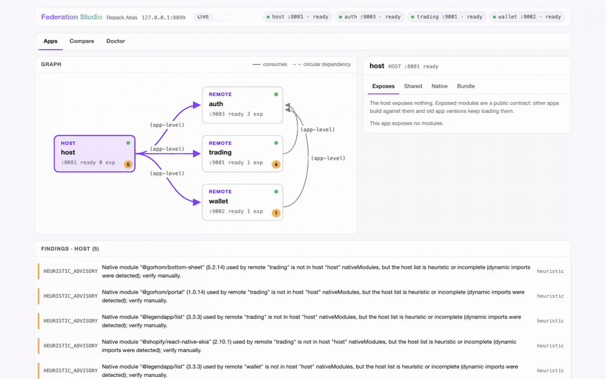

# Repack Atlas

Local developer tooling for React Native **Module Federation** workspaces built
with [Re.Pack](https://re-pack.dev). It answers three questions in seconds,
without a simulator:

- **What is my federation setup?** A graph of host and mini-apps: who exposes
  what, who consumes it, which shared versions and native modules are in play.
- **Is it correct?** A doctor that finds shared-version drift, singleton and
  eager mismatches, circular remotes, and native modules the host does not
  declare.
- **Can I run it?** An interactive dev runner that starts the whole workspace
  and serves a read-only **Federation Studio** page.



_Federation Studio on a real Re.Pack workspace (host + 3 mini-apps). The
walkthrough is in [`docs/demo-showcase.md`](docs/demo-showcase.md)._

Atlas grew out of three stacked Re.Pack PRs
([#1463](https://github.com/callstack/repack/pull/1463),
[#1466](https://github.com/callstack/repack/pull/1466),
[#1467](https://github.com/callstack/repack/pull/1467)). The Re.Pack team
concluded this is workspace tooling, not bundler scope, so it lives here; core
Re.Pack keeps only the small enabling changes. `docs/PRD.md` is the source of
truth for the whole design.

## Quickstart

Requirements: Node >= 22.13, pnpm >= 10 (`packageManager` pins the exact version).

```bash
git clone <this repo> && cd repack-atlas
pnpm install
pnpm build
pnpm test        # 274 tests, fixtures only, a few seconds
```

### The 3-minute demo

The repo ships throwaway fixture workspaces under `fixtures/`, so you can see
the doctor and the runner with zero setup. Both commands below were run from a
fresh clone; the output is real.

Doctor on a workspace with a deliberate singleton version conflict:

```
$ node dist/cli.js doctor --workspace fixtures/fixture-version-drift; echo $?
host:   host  .../fixtures/fixture-version-drift/manifests/host.json
remote: mini_auth  .../fixtures/fixture-version-drift/manifests/mini-auth.json
remote: mini_store  .../fixtures/fixture-version-drift/manifests/mini-store.json

errors (1):
  SHARED_VERSION_DRIFT [static] Singleton shared dependency "react" resolves to
  different versions: host "host" has 19.0.0, remote "mini_store" has 19.1.0.
  Align the versions (or remove singleton).

summary: 1 error, 0 warnings, 0 info
1
```

Exit codes are a contract: `0` clean (warnings allowed), `1` ran and found
errors, `2` could not answer. The clean fixture exits `0`. A remote manifest
that exists but cannot be read is a named `MANIFEST_UNREADABLE` error (exit `1`,
the other remotes are still checked); exit `2` is for runs with nothing to
compare: no or invalid config, an unreadable host manifest, or every remote
manifest unreadable.

The dev runner starts every app in a workspace and serves the Studio page:

```
$ node dist/cli.js dev --workspace fixtures/workspace --ci --studio-port 0
Federation Studio (read-only): http://127.0.0.1:50955/
dev: supervising 3 app(s) (host:50950 mini_auth:8082 mini_store:8083)
dev: host → starting (port 50950)
[host] ready
[mini_auth] ready
[mini_store] ready
dev: host → ready (port 50950)
dev: mini_auth → ready (port 8082)
dev: mini_store → ready (port 8083)
```

Open the printed URL. Drop `--ci` on a real terminal for key handling (press
`v` to open the Studio, `q` to quit). The fixture apps are stub bundlers that
serve checked-in manifests, which is why this takes seconds.

### Your own workspace

Atlas reads `repack-federation.json` plus one federation manifest per app. To
point it at a real project, add two plugins to each app's rspack config:
`repack-atlas/plugin` (emits the manifest) and `repack-atlas/introspection`
(feeds `init` and the workspace config). Both are opt-in; see PRD §8 for what
upstream change this works around. Then:

```bash
npx repack-atlas init --workspace /path/to/workspace   # discovers apps, derives commands
npx repack-atlas doctor --workspace /path/to/workspace
```

Two optional `repack-federation.json` fields are easy to misread:

- `root` (host and remotes): only the dev runner uses it. It is resolved
  against the config directory and handed to the app process as
  `ATLAS_APP_ROOT`; the process itself runs from the config directory. Doctor,
  graph and Studio resolve `manifest` relative to the config directory and
  ignore `root`.
- `remotes.<name>.standalone`: a flag you declare ("this remote can run
  without the host"). Atlas only checks that it is a boolean and never acts on
  it. The Studio shows a read-only `standalone` badge on that remote when it is
  `true`.

### Installing Atlas in a project

No npm publish yet (PRD §13: git-only until the incubator decision):

```bash
npm install github:<owner>/repack-atlas    # or the pnpm equivalent
```

## Fixtures tour

Each fixture variant provokes exactly one finding; `pnpm test` asserts every
row. Expectations also live in `fixtures/README.md`.

| Variant | Finding | Exit |
|---|---|---|
| `workspace/` | none (clean) | `0` |
| `fixture-remote-cycle/` | `REMOTE_CYCLE` (warning) | `0` |
| `fixture-version-drift/` | `SHARED_VERSION_DRIFT` | `1` |
| `fixture-missing-native/` | `MISSING_NATIVE_MODULE` | `1` |
| `fixture-corrupt-manifest/` | `MANIFEST_UNREADABLE` (names the app) | `1` |
| `fixture-heuristic-downgrade/` | `HEURISTIC_ADVISORY` (warning) | `0` |
| `fixture-missing-remote-manifest/` | `MISSING_REMOTE_MANIFEST` | `1` (`0` with `--allow-missing-manifests`) |
| `fixture-xss/` | hostile strings render as text in Studio | `0` |

## Agent files

This repo is set up to be worked on by any coding agent: Claude Code, Codex,
Apex/OpenCode, Cursor, VS Code. `AGENTS.md` is the single source of truth;
canonical skills live in `.agents/skills/` (agentskills.io format), and
`pnpm agent:sync` generates the `.claude/skills/` symlinks plus the AGENTS.md
tables. CI runs `pnpm agent:check` and fails on drift. Add a skill by dropping
a folder with a `SKILL.md` and running the sync; see CONTRIBUTING.md.

## Checks CI runs (reproduce locally)

```bash
pnpm lint          # ESLint incl. bridge-fence and core-boundary rules
pnpm typecheck     # tsc --noEmit over src + tests
pnpm build         # src -> dist
pnpm test          # node:test via tsx
pnpm agent:check   # agent files sync drift (exit 1 on drift)
pnpm check:vendored  # every vendored file is in VENDORED.md w/ a commit sha
pnpm test:e2e      # Playwright over the Studio preview (needs:
                   #   pnpm exec playwright install chromium)
```

## Vendored code

`src/repack-bridge/vendored/` contains code copied from
`callstack/repack` (branch `feat/federation-manifest`, commit `c5df67f0`)
under the MIT license, with per-file copyright headers. `VENDORED.md` is the
provenance ledger: every file, its upstream path, why it is vendored, and the
condition under which each block gets deleted and re-exported from
`@callstack/repack`. CI enforces the ledger (`pnpm check:vendored`).

## License

MIT. See [LICENSE](LICENSE). Vendored files retain their upstream MIT
copyright headers.
